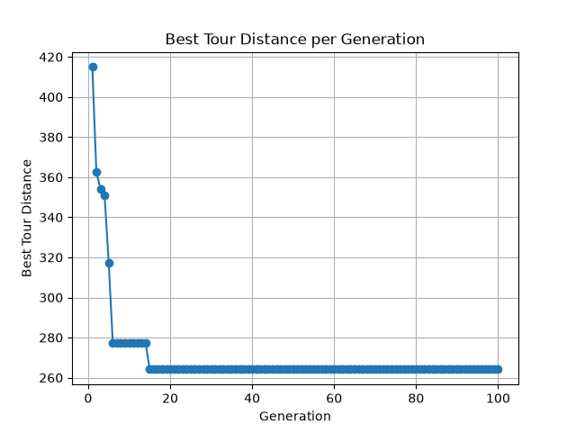
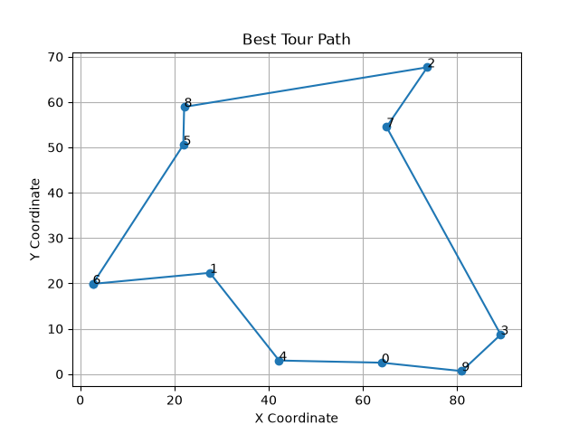

# Genetic Algorithm for the Traveling Salesman Problem

A genetic algorithm that evolves tours for the Traveling Salesman Problem: given a set of cities, find a short route that visits every city once and returns to the start. TSP is NP-hard, so past a handful of cities you can't just check every possible tour. A GA doesn't guarantee the optimal one, but it searches the space of permutations by breeding good tours together instead of guessing randomly.

Run it with the defaults, 10 cities, a population of 50, 100 generations, and it finds its best tour by around generation 15 and holds there for the rest of the run. Whole thing finishes in about a second.

This started as a lab assignment for a graduate algorithms course. I've since restructured the notebook into a small Python package: same GA logic, split into modules, runnable from the command line, plots written to disk instead of popping up inline.

## Layout

- `tsp_ga/tour.py`: tour representation, distance, and fitness (inverse of distance, so shorter tours score higher)
- `tsp_ga/operators.py`: selection, crossover, mutation
- `tsp_ga/ga.py`: the generational loop and the convergence check
- `tsp_ga/main.py`: CLI, wires everything together, saves the plots
- `docs/`: two plots from an example run (`--seed 42`), committed so they render on GitHub
- `output/`: where your own runs land. Gitignored, it's just scratch output.

## How the GA works

A tour is a permutation of city indices, e.g. `[3, 0, 4, 1, 2]` means visit city 3, then city 0, then city 4, and so on, then return to city 3. Fitness is `1 / total_distance`, so a shorter tour scores higher.

**Selection.** Each parent is chosen by tournament selection: pick 3 random tours from the population, keep the fittest. It's cheap, it doesn't require ranking the whole population, and tournament size gives you a direct knob on selection pressure without computing selection probabilities the way roulette-wheel selection would.

**Crossover.** This is the part that actually needs care for TSP. A tour is a permutation, every city has to appear exactly once. Naive single or two-point crossover, the kind you'd use on a bit string, copies a slice from parent A and fills the rest from parent B at the same positions. For a permutation that almost always produces a child with some cities missing and others duplicated. Not a valid tour.

The fix is order crossover (OX): copy a slice from parent 1 into the child, then walk through parent 2 in order starting right after that slice, and fill the remaining child positions with whatever cities aren't already there. That's the repair logic mentioned in the code. It isn't a separate cleanup pass, it's built into how the fill happens, so the child is guaranteed to be a valid permutation by construction. It also keeps the relative order of the cities it inherits from parent 2, which is a more useful kind of inheritance for a routing problem than pure position-based copying.

**Mutation.** Swap mutation: with probability `mutation_rate`, pick two positions in the tour and swap them. Same reasoning as crossover, a swap can't produce an invalid tour, since it's still a permutation of the same cities. One thing to know if you're tuning `mutation_rate`: it's checked once per child, not once per city. A rate of 0.2 means a 20% chance the child gets exactly one swap, not that each city independently has a 20% chance of moving. Turning the rate up increases how many children get touched, not how many swaps land on any single one of them.

**Elitism.** The top 2 tours survive unchanged into the next generation before any breeding happens. This guarantees the best tour found so far never gets lost to a bad crossover draw or an unlucky mutation. The best-so-far distance can only hold steady or improve, generation over generation, never regress.

## Convergence

Every generation the loop records the best tour distance found so far. If the spread between the best and worst of the last 20 recorded values is under `1e-6`, the run is marked converged. Because of elitism that best distance is monotonic, it never gets worse, so a flat window over 20 generations really does mean the population stopped finding anything better. It isn't just a few unlucky generations in a row.

## Running it

```
pip install -r requirements.txt
python tsp_ga/main.py
```

That runs with the defaults: 10 cities, population 50, 100 generations, mutation rate 0.2, no seed. It prints the best distance per generation as it goes, then saves two plots to `output/`: the fitness curve and the best tour found.

Flags:

- `--num-cities`: number of cities (default 10)
- `--population-size`: tours per generation (default 50)
- `--generations`: how many generations to run (default 100)
- `--mutation-rate`: probability of a swap mutation per child (default 0.2)
- `--seed`: set this for a reproducible run
- `--output-dir`: where the plots get saved (default `output`)

Bigger problem, fixed seed:

```
python tsp_ga/main.py --num-cities 25 --population-size 100 --generations 300 --mutation-rate 0.15 --seed 7
```

## Example run

Both plots below came from `--seed 42` with the defaults above. The best distance drops fast over the first 15 generations, then flatlines: elitism holds the best tour in place while the rest of the population keeps trying, and mostly failing, to beat it.



